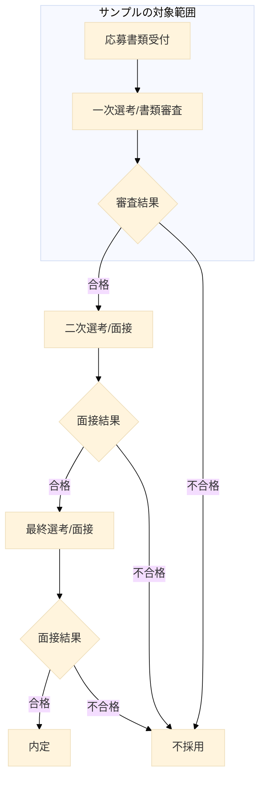

# 概要

コードの可読性を向上させるためにはどのような工夫が必要でしょうか。  
まずはコードの可読性を理論的に体感してみましょう。   
呼び出す側よりも呼び出される側の可読性が重要です。

# 答え
型で語る  
[関数名を意味のない名前にした場合](https://github.com/l-freeze/how-far-safe-to-what-make-changes/tree/version/001-change-func-x) - このコードの処理を追えるでしょうか？  
[引数名、変数名もを意味のない名前にした場合](https://github.com/l-freeze/how-far-safe-to-what-make-changes/tree/version/002-change-parameter) - このコードの処理を追えるでしょうか？

どこまで改変したら読めなくなるの試してみてください。

# 選考フロー仮

# 応募者情報

---
- 氏名
  - 就職　四太郎
- 住所
  - 東京都
  - 港区
  - 六本木 1-1-1
  - 123-4567
- 年齢
  - 30歳
- 職務経歴
  - developer
  - project-manager
  - lead-engineer
  - tester
- スキル
  - typescript
  - html
  - F#
  - rust
  - docker
  - ansible
---

